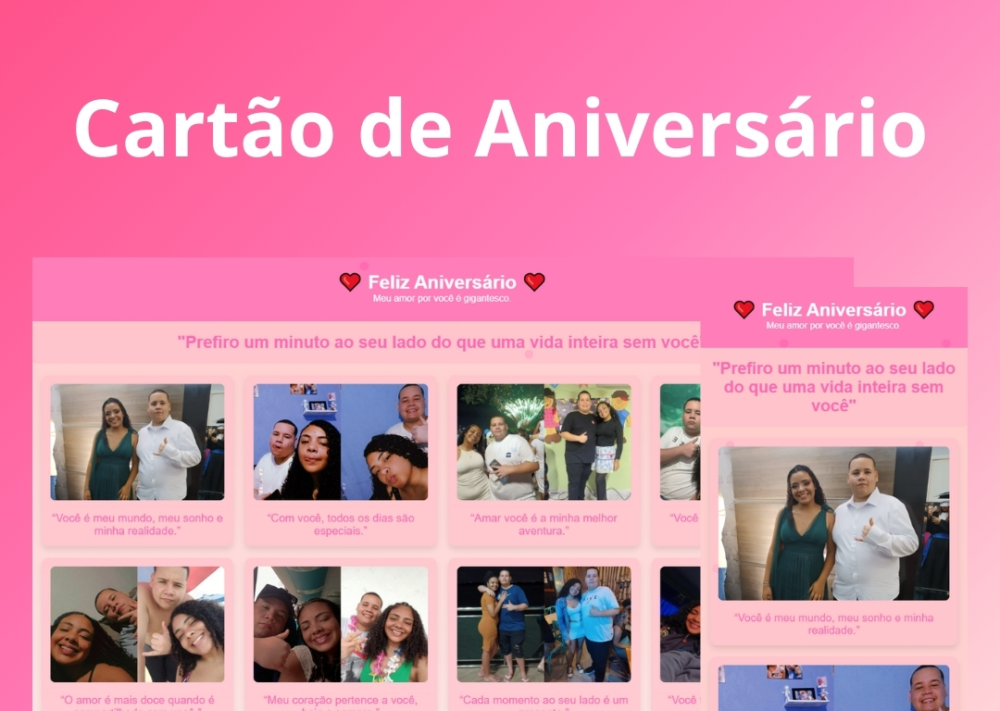

<h1 align="center"> Cartão Romântico de Aniversário </h1>

Cartão Romântico de Aniversário para surpreender e presentear uma pessoa muito amada!

  <a href="#-tecnologias">Tecnologias</a>&nbsp;&nbsp;&nbsp;|&nbsp;&nbsp;&nbsp;
  <a href="#-projeto">Projeto</a>&nbsp;&nbsp;&nbsp;|&nbsp;&nbsp;&nbsp;

 

  

## 🚀 Tecnologias

Esse projeto foi desenvolvido com as seguintes tecnologias:

- HTML e CSS
- JavaScript
- Git e Github

## 💻 Projeto

Apresento o Cartão de Feliz Aniversário, uma homenagem carinhosa, repleta de amor e dedicação. Com este site, você compartilha momentos especiais e expressa sentimentos de forma única e encantadora. Imagens lindas, mensagens românticas e animações delicadas tornam este cartão digital a forma perfeita de celebrar a pessoa amada. Ideal para transformar qualquer aniversário em uma experiência inesquecível, tornando a data ainda mais significativa e emocionante.

---

Feito por Riquelme Guedes